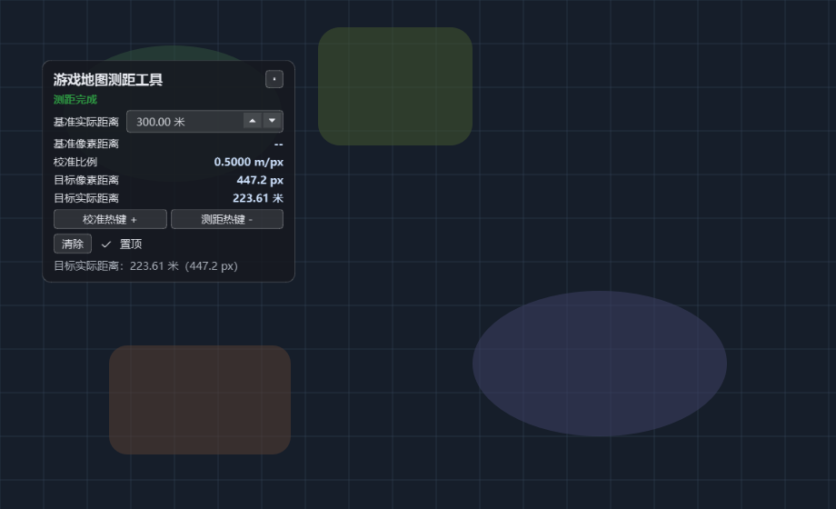

# 游戏地图测距工具（Game Map Ruler）

Windows 置顶小面板工具：热键按下瞬间取鼠标位置为像素点，两次按键完成一次测距。
纯屏幕级工具，不注入、不修改游戏进程。

## 功能

- **功能1：校准（建立基准比例）**（校准热键，默认 `+`）
  1. 在游戏中把鼠标放在第一个已知点，按 `+`（开始 + 确定 A 点）；
  2. 移到第二个已知点，再按 `+`（确定 B 点 + 结束结算）；
  3. 得到 `校准比例 = 基准实际距离 / 基准像素距离`，自动保存。
- **功能2：测距**（测距热键，默认 `-`）
  1. 鼠标放在目标一端，按 `-`（A 点）；
  2. 移到目标另一端，按 `-`（B 点 + 结束结算）；
  3. 得到 `目标实际距离 = 目标像素距离 × 校准比例`。
- 面板**置顶**显示四项数值：基准像素距离、基准实际距离、目标像素距离、目标实际距离（另有校准比例），游戏中随时可见；可拖动、可关闭置顶。

## 界面展示



*示意图：左侧为置顶面板（半透明、可拖动），右侧为模拟的游戏地图背景；实际使用时面板悬浮于游戏窗口之上，两次按键即可完成一次测距。*

面板自上而下为：

| 区域 | 内容 |
|---|---|
| 标题行 | 工具名称 + 关闭按钮 |
| 状态行 | 空闲 / 校准中 / 测距中 / 完成等状态提示 |
| 数值区 | 基准实际距离（可输入）、基准像素距离、校准比例、目标像素距离、目标实际距离 |
| 热键行 | 「校准热键 +」「测距热键 -」按钮，点击可改绑热键 |
| 操作行 | 「清除」按钮、置顶开关（可关闭置顶） |
| 提示行 | 操作指引与错误说明（如"未捕获到游戏窗口"） |

## 安装与运行

需要 Python 3.10+（已加入 PATH，或使用 Windows 官方 `py` 启动器）。

```powershell
# 二选一：使用 py 启动器（推荐），或 PATH 中的 python
py -3 -m pip install -r requirements.txt
py -3 main.py
# 或者：
python -m pip install -r requirements.txt
python main.py
```

也可直接双击/运行 `run.bat`：脚本会自动探测 Python（优先 `py` 启动器，其次 PATH 中的 `python`），无需手动指定路径；未找到 Python 3.10+ 时会提示安装方法并退出。

## 使用说明

1. 启动工具，面板置顶显示"空闲"（启动时**不会抢占游戏焦点**）；
2. **先校准**：面板中输入基准实际距离（默认 300 米），游戏中按 `+` 两次完成校准（比例自动保存，重启后仍有效）；
3. 之后按 `-` 两次即可测任意目标距离；
4. 改热键：点面板上的"校准热键 +" / "测距热键 -" 按钮，按下新键（支持 A–Z、0–9、F1–F12、+、-、=）；
5. 取消会话：面板聚焦时按 Esc、在面板上右键，或点"清除"。

按键在**游戏窗口聚焦时全局生效**（RegisterHotKey），无需切换窗口；按键瞬间的鼠标位置即为像素点。
首次按键前请确认游戏窗口在前台；若按键无反应，查看面板**底部提示行**的小字说明（如"未捕获到游戏窗口""鼠标不在目标窗口内"等）。

## 配置文件

`config.json`（与 main.py 同目录）：

```json
{
  "hotkey_calibrate": "+",
  "hotkey_target": "-",
  "reference_meters": 300.0,
  "ratio_m_per_px": 0.0,
  "calibrated": false
}
```

## 限制与注意事项

- 目标平台为 Windows 10/11；程序启动时声明 Per-Monitor DPI Aware，坐标均为物理像素。
- 两次按键之间**游戏窗口不要移动或缩放**（结算时会校验并警示）。
- 校准为屏幕直线距离，未处理游戏内透视变形/地图比例尺变化，适用于画面内近似直线距离。
- 热键被游戏或其他程序占用时注册失败：面板会提示并降级为面板内快捷键，请改用其它键。
- 鼠标不在游戏窗口内时按键会被忽略。
- 最小化/不可见窗口无法作为目标。

## 手动验收清单

1. 游戏中鼠标放某点按 `+` → 面板状态变"校准：已选 A"；移另一点再按 `+` → 基准像素距离与校准比例更新，与手算一致；
2. 未校准时按 `-` → 提示先校准；校准后按 `-` 两次 → 目标像素距离与目标实际距离正确；
3. 鼠标在窗口外按键被忽略；会话中按错热键被忽略；Esc/右键/清除可取消；
4. 面板在游戏中保持置顶、可拖动；置顶开关生效；关闭后重新打开配置保留；
5. 改绑热键后新键生效，重启后保留。

## 许可证

[GPL-3.0](LICENSE) © 2026 justplaymore

本项目以 GNU General Public License v3.0 发布：您可以自由使用、修改和分发本软件，但**衍生作品必须同样以 GPL-3.0 开源**；允许商业使用，前提是必须开源。详见 [LICENSE](LICENSE) 全文。

## 测试

```powershell
python -m unittest discover -s tests -v   # 或 pytest tests
```

## 项目结构

```
game-map-ruler/
├── main.py           # 入口（DPI 感知 → QApplication → 主窗口）
├── main_window.py    # 置顶 HUD 面板、WM_HOTKEY 处理、状态机驱动
├── hotkey.py         # 热键映射/注册/捕获对话框
├── winapi.py         # Windows API 封装（ctypes）
├── app_state.py      # 测距会话状态机（纯逻辑）
├── geometry.py       # 距离/比例/换算/坐标映射（纯函数）
├── config.py         # config.json 读写
└── tests/            # 单元测试（geometry / app_state / config）
```
